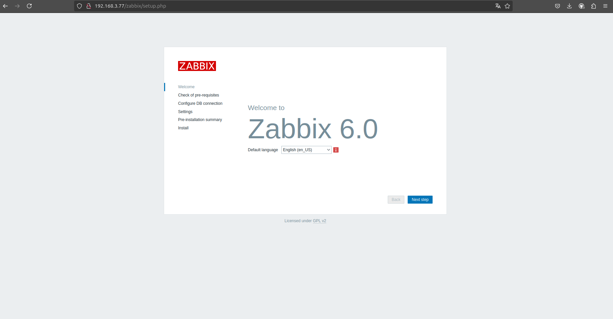

# 🖥️ Criando uma máquina pelo Vagrant com Zabbix Server

## 📑 Índice
1. [Descrição](#-descrição)
2. [Requisitos](#-requisitos)
3. [Como Subir a Máquina Virtual](#-como-subir-a-máquina-virtual)
4. [Explicação de cada programa instalado](#-explicação-de-cada-programa-instalado)
   - [MySQL Server](#-mysql-server)
   - [Zabbix Server](#-zabbix-server)
   - [Zabbix Frontend PHP](#-zabbix-frontend-php)
   - [Zabbix Apache Configuration](#-zabbix-apache-configuration)
   - [Zabbix Agent](#-zabbix-agent)
5. [Acessando o Zabbix Server](#-acessando-o-zabbix-server)
6. [Verificação dos Serviços](#-verificação-dos-serviços)
7. [Como Parar ou Remover a Máquina Virtual](#-como-parar-ou-remover-a-máquina-virtual)
8. [Links](#-links)

## 📝 Descrição
Este projeto cria uma máquina virtual utilizando Vagrant para instalar e configurar automaticamente o Zabbix Server, um sistema de monitoramento de redes e servidores, e o MySQL como banco de dados.

## ⚙️ Requisitos
Antes de começar, certifique-se de ter instalado:
- [Vagrant](https://www.vagrantup.com/downloads)
- [VirtualBox](https://www.virtualbox.org/)

## 🚀 Como Subir a Máquina Virtual
1. Clone este repositório:
   ```bash
   git clone https://github.com/JoaoGSantiago/vagrant_zabbix.git
   cd vagrant_zabbix
   ```
2. Inicie a máquina virtual:
   ```bash
   vagrant up
   ```
3. Para acessar a máquina:
   ```bash
   vagrant ssh
   ```

## 📦 Explicação de cada programa instalado:

### 🗄️ MySQL Server
- Banco de dados relacional que armazena as informações coletadas pelo Zabbix Server.

### 📊 Zabbix Server
- O serviço principal do Zabbix que coleta, processa e armazena dados de monitoramento.

### 🌐 Zabbix Frontend PHP
- Interface web utilizada para visualizar métricas e configurar o monitoramento.

### ⚙️ Zabbix Apache Configuration
- Arquivos de configuração do Apache para servir a interface do Zabbix.

### 🕵️ Zabbix Agent
- Serviço instalado na máquina que coleta informações locais e as envia para o Zabbix Server.

## 🌍 Acessando o Zabbix Server
Após a inicialização da VM, acesse o Zabbix através do navegador:
```
http://<IP-DA-VM>/zabbix
```


- **Usuário padrão**: `Admin`
- **Senha padrão**: `zabbix`

## 🔍 Verificação dos Serviços
Para garantir que tudo está rodando corretamente, execute:
```bash
systemctl status mysql
systemctl status zabbix-server
systemctl status apache2
```

## 🛑 Como Parar ou Remover a Máquina Virtual
Se precisar parar a VM:
```bash
vagrant halt
```
Se quiser remover completamente a VM:
```bash
vagrant destroy -f
```

## 🔗 Links
[Repositório no GitHub](https://github.com/JoaoGSantiago/vagrant_zabbix/)
